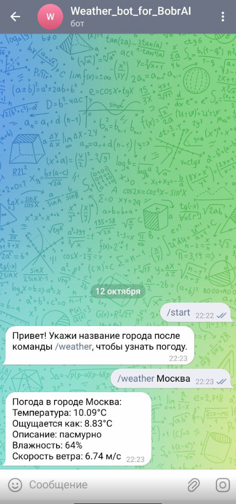

This bot was developed as a test task for the BobrAI company.

Important: be sure to save tokens and all confidential information in environment variables.

All logic is presented in `handlers/start.py`. If necessary, you can add all other new handlers to this directory.

**What this bot can do**
Calls to the API of one of the weather services (it doesn't matter which one). Accepts the response. Parses JSON and gives the result in the bot.

**Commands**
So far, the bot knows only two commands:

- First: starts automatically when the bot starts;
- Second: you can specify the name of the city after the `/weather` command to find out about the weather in this city.

